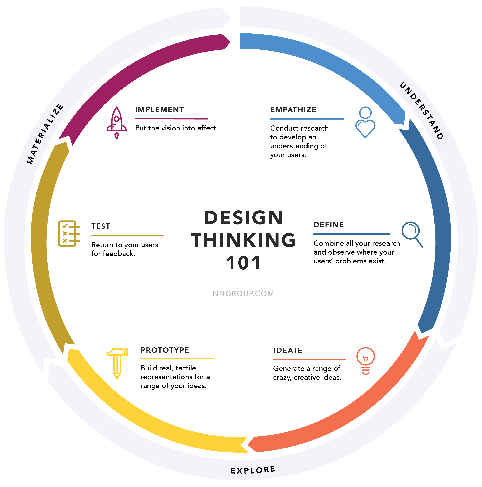

---

# **Design Thinking**

**Jamk InnoFlash (2022)** -kurssi pohjautui **Design Thinking**:iin eli muotoiluajatteluun, joka on ihmiskeskeinen ja kokeileva lähestymistapa monimutkaisten ongelmien ratkaisuun. 
Menetelmässä korostuvat aitojen käyttäjätarpeiden ymmärtäminen, monialainen yhteistyö sekä ideoiden nopea jalostaminen prototyypeiksi ja niiden testaus käytännössä. Kyseessä on iteratiivinen prosessi, jossa epävarmuus hyväksytään ja parhaat ratkaisut muotoutuvat vaiheittain saatavan palautteen pohjalta.

Tämä materiaali käsittelee design thinking -menetelmää sen eri vaiheissa:

- **Perusteet** – mikä design thinking on ja mitkä ovat sen periaatteet
- **Empatisoi** – käyttäjän ymmärtäminen ja tarpeiden kartoittaminen
- **Määrittele** – ongelman muotoilinen ja tiedon syntesisointi
- **Ideoi** – luovien ratkaulausten kehittäminen
- **Prototypoi** – nopeiden prototyyppien luominen
- **Testaa** – ratkausten testaaminen ja palautteen analysointi
- **Yhteenveto** – menetelmät ja työkalut yhtä suurta katsauksena

## InnoFlash 2022

InnoFlash on Jyväskylän ammattikorkeakoulun Future Factoryn opintojakso, **jossa monialaiset opiskelijatiimit ratkovat yritysten aitoja kehittämishaasteita uutta luovalla, systemaattisella ideoinnilla sekä nopealla prototyypoinnilla.**

Työskentelimme projektissa monialaisena tiiminä läpi koko Design Thinking -prosessin aina käyttäjäymmärryksen kartoituksesta ja ongelman määritelmästä ideointiin, prototyyppien rakentamiseen sekä käyttäjätestaukseen. Huomasimme käytännössä, miten vaikuttavimmat ratkaisut syntyvät yhdistämällä tiimimme monipuolisen osaamisen, kokeilevan kehittämisotteen sekä toimeksiantajan sekä näkyvät että piilevät tarpeet.

---
